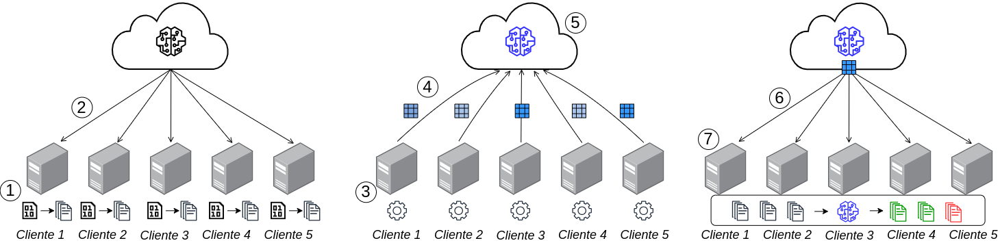

# Fine-Tuning Eficiente de Modelos de Linguagem Para Detectar Anomalias em Logs Privados usando Aprendizado Federado

**Resumo**: 
O crescimento acelerado de sistemas distribuídos em redes de computadores tem ampliado as preocupações com vulnerabilidades, falhas e ataques maliciosos, tornando a detecção de anomalias uma tarefa crucial para garantir a confiabilidade e segurança desses sistemas. A análise de logs de sistema desponta como uma abordagem promissora para identificar comportamentos anômalos, mas enfrenta desafios significativos, como a falta de flexibilidade, eficiência computacional e adaptabilidade para cenários distribuídos e restritos em recursos, além de questões relacionadas à privacidade dos dados. Este trabalho investiga o uso de modelos de linguagem aliados a técnicas de eficiência de treinamento e comunicação no contexto do aprendizado federado, com o objetivo de aprimorar a detecção de anomalias em cenários desafiadores. A abordagem proposta viabiliza o treinamento colaborativo e privado entre múltiplos clientes, preservando a privacidade dos dados enquanto otimiza a eficiência em ambientes de recursos limitados. Resultados demonstram o desenvolvimento bem-sucedido de um fluxo de trabalho para ajuste de modelos de linguagem na detecção de anomalias, com análises detalhadas de desempenho atingindo performance superior a 98\% de F1 além de uma redução de até 4000x no tamanho das mensagens transmitidas delineando assim diretrizes promissoras para futuros avanços na área.

\


## Como Rodar
### Configuração do Ambiente

Para configurar o ambiente, siga os passos abaixo:

1. Clone este repositório:
   ```bash
   git clone https://github.com/GabrielTalasso/FL-LLM-AD.git
   cd FL-LLM-AD
   ```
2. Crie e ative um ambiente virtual:
   ```bash
   python3 -m venv .venv
   source .venv/bin/activate
   ```
3. Instale as dependências:
   ```bash
   pip install -r requirements.txt
   ```

### Preparação do Dataset

Execute os seguintes scripts na ordem indicada:

1. **Download do dataset**:
   ```bash
   bash dataset/download_hdfs.sh
   ```
2. **Geração de janelas de sessão**:
   ```bash
   python dataset/session_window.py
   ```
3. **Pré-processamento do dataset**:
   ```bash
   python dataset/preprocess_dataset.py
   ```
4. **Tokenização do dataset**:
   ```bash
   python dataset/tokenize_dataset.py
   ```

### Treinamento Federado

Para iniciar o treinamento, execute o seguinte comando:

```bash
python federated_training.py --sim_name "experimento1" \
    --num_rounds 50 \
    --num_clients 50 \
    --client_frac 0.1 \
    --model_name "HuggingFaceTB/SmolLM-135M" \
    --dataset_path "../.dataset/hdfs/tokenized" \
    --lora \
    --lora_rank 8 \
    --nrows None \
    --cuda_device "0" \
    --max_steps 10 \
    --batch_size 32
```

### Parâmetros Principais
- `--sim_name`: Nome da simulação a sua escolha.
- `--num_rounds`: Número total de rodadas de treinamento federado.
- `--num_clients`: Número total de clientes na federação
- `--client_frac`: Fração de clientes selecionados por rodada.
- `--model_name`: Nome ou caminho do modelo pré-treinado no HuggingFace (e.g. "HuggingFaceTB/SmolLM-135M", "HuggingFaceTB/SmolLM-360M" e "HuggingFaceTB/SmolLM-1.7B")
- `--dataset_path`: Caminho para o dataset tokenizado.
- `--lora`: Habilita LoRA (True ou False).
- `--lora_rank`: Rank para LoRA.
- `--nrows`: Número de amostras do dataset total (caso vá limitar, se não, manter None para utilizar todas).
- `--cuda_device`: Dispositivo CUDA a ser usado.
- `--max_steps`: Número máximo de passos de treinamento por cliente.
- `--batch_size`: Tamanho do batch para treinamento.

### Avaliação do Modelo

Para avaliar a predição do próximo token no modelo treinado, execute:

```bash
python federated_evaluation.py --sim_name "experimento1" \
    --model_name "HuggingFaceTB/SmolLM-135M" \
    --dataset_path "../.dataset/hdfs/test.csv" \
    --nrows None \
    --n_rounds 50 \
    --lora \
    --cuda_device "0"
```

### Parâmetros Principais
- `--sim_name`: Nome da simulação.
- `--model_name`: Nome ou caminho do modelo pré-treinado no HuggingFace (e.g. "HuggingFaceTB/SmolLM-135M", "HuggingFaceTB/SmolLM-360M" e "HuggingFaceTB/SmolLM-1.7B")
- `--dataset_path`: Caminho para o dataset de teste.
- `--nrows`: Número de amostras do dataset total (caso vá limitar, se não, manter None para utilizar todas).
- `--n_rounds`: Número de rodadas para avaliar.
- `--lora`: Habilita LoRA (True ou False).
- `--cuda_device`: Dispositivo CUDA a ser usado.

## Como citar
```bibtex
@inproceedings{talasso_sbrc2025,
 author = {Gabriel Talasso and Allan de Souza and Daniel Guidoni and Eduardo Cerqueira and Leandro Villas},
 title = { Fine-Tuning Eficiente de Modelos de Linguagem Para Detectar Anomalias em Logs Privados usando Aprendizado Federado},
 booktitle = {Anais do XLIII Simpósio Brasileiro de Redes de Computadores e Sistemas Distribuídos},
 location = {Natal/RN},
 year = {2025},
 keywords = {},
 issn = {2177-9384},
 pages = {126--139},
 publisher = {SBC},
 address = {Porto Alegre, RS, Brasil},
 doi = {10.5753/sbrc.2025.5859},
 url = {https://sol.sbc.org.br/index.php/sbrc/article/view/35127}
}
```
mkdir -p ./fl-results/experimentos_poucos_passos_135m/emissions
python3 federated_training.py \
    --sim_name "experimentos_poucos_passos_135m" \
    --num_rounds 50 \
    --num_clients 50 \
    --client_frac 0.1 \
    --model_name "HuggingFaceTB/SmolLM-135M" \
    --dataset_path "../.dataset/hdfs/tokenized" \
    --lora \
    --lora_rank 8 \
    --cuda_device "0" \
    --max_steps 10 \
    --batch_size 32
    


    python3 federated_evaluation.py \
    --sim_name "experimentos_poucos_passos_135m" \
    --model_name "HuggingFaceTB/SmolLM-135M" \
    --dataset_path "../.dataset/hdfs/test.csv" \
    --n_rounds 50 \
    --lora \
    --cuda_device "0"